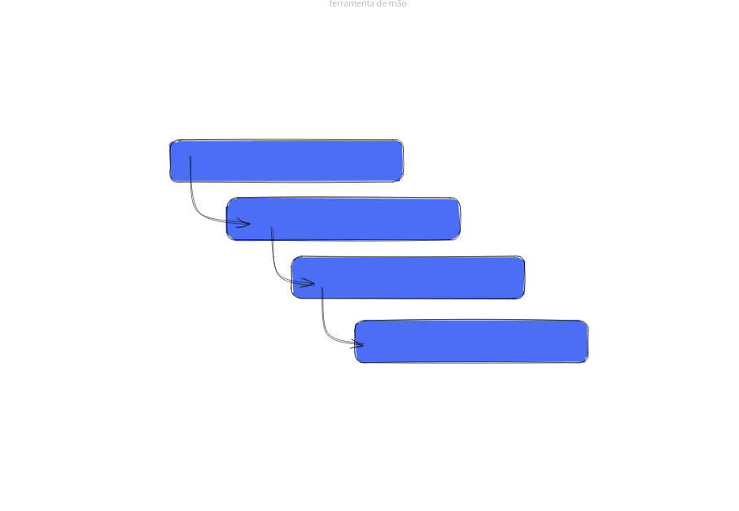

# Prop Drilling

The most simple way to pass data between components is using props, but it can lead to a messy code and probably making it unmaintainable, specially with prop drilling, where a props have to be passed to multiple layers of components:

## Reference

- [Prop Drilling: o que é? - Alura](https://www.alura.com.br/artigos/prop-drilling-no-react-js)
